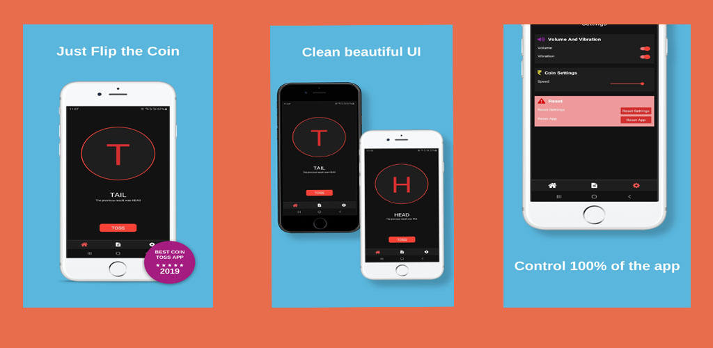
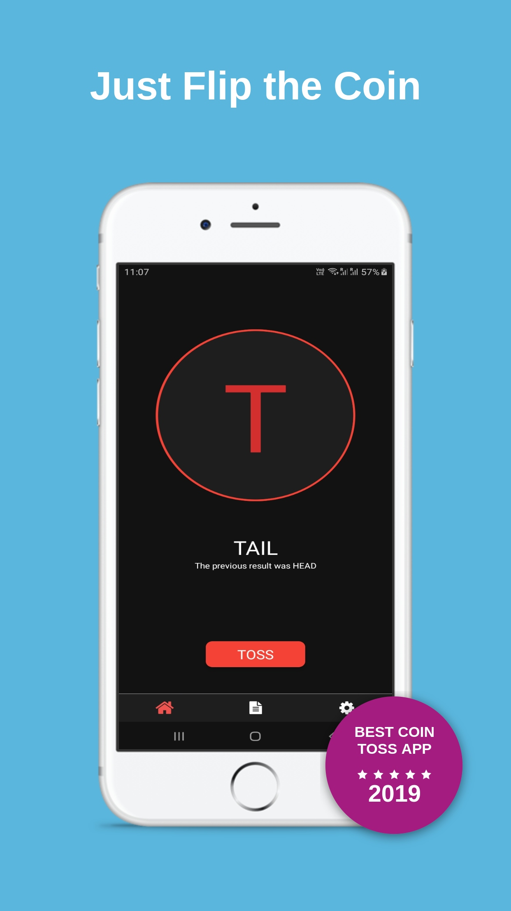
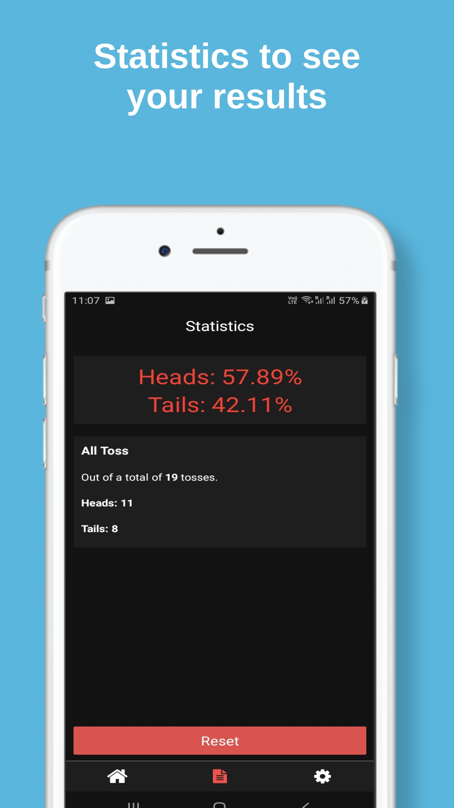
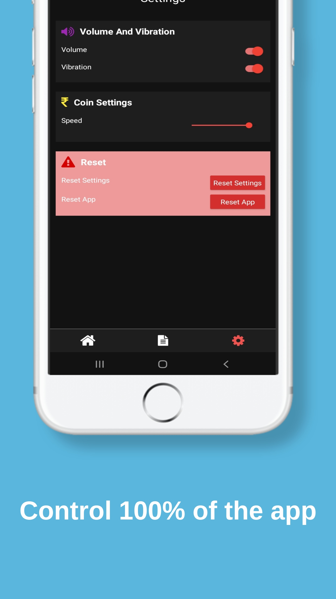
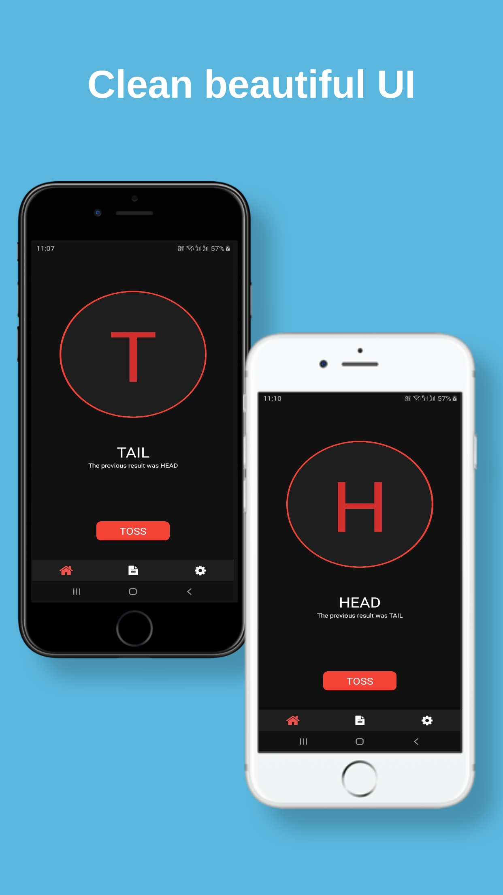
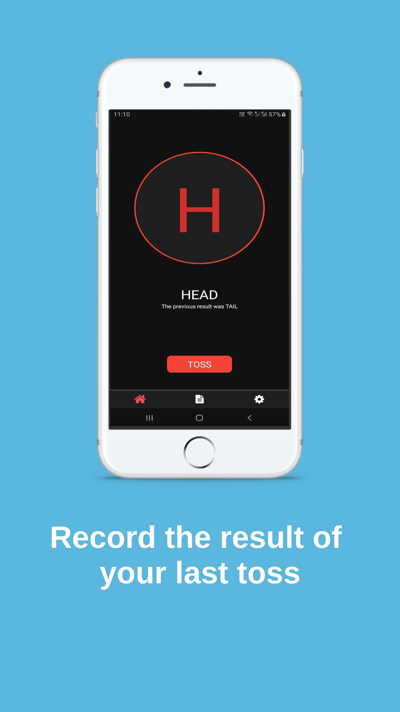

# Coin Toss - Flip A Coin

## Short Description

Flip this virtual coin to get a head or a tail and make a decision

## Long Description

Coin toss - Flip a coin is a FREE tossing/flipping game or tool. There are a number of situations when we cannot make up our minds. Flipping a coin is our best bet at those times. With this coin toss app, you need not possess a real coin.
Features
#1 Head or tails
#2 Control audio and vibration
#3 Control the speed of the flip of the coin
#4 Statistics to let you know the percentage of time you got a head and when you got a tail
#5 Reset statistics
#6 Clean UI

- You need not remember the result of your last flip. Coin Toss - Flip A Coin does that for you. It remembers the result of the last coin toss.
- You can also see the general trend of getting a head or tail at a coin toss event.
- You can challenge your friends for a coin toss game.
- You don't need  to carry  a coin, just flip this coin

#coinToss #flipACoin #toss #tossGame

## Features

#1 Head or tails

#2 Control audio and vibration

#3 Control the speed of the flip of the coin

#4 Statistics to let you know the percentage of time you got a head and when you got a tail

#5 Reset statistics

#6 Clean UI

## Tech Stack

I could not complete this project without the help of redux, redux-persist, native-base, react-naive-vector-icons, react-navigation, and styled-components

   

## Resources

Learn about playstore here https://developer.android.com/
distribute/best-practices/launch
App screenshots from: https://app.shotbot.io/
